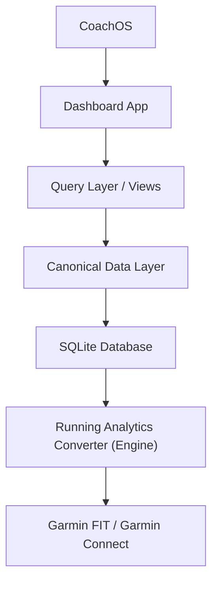
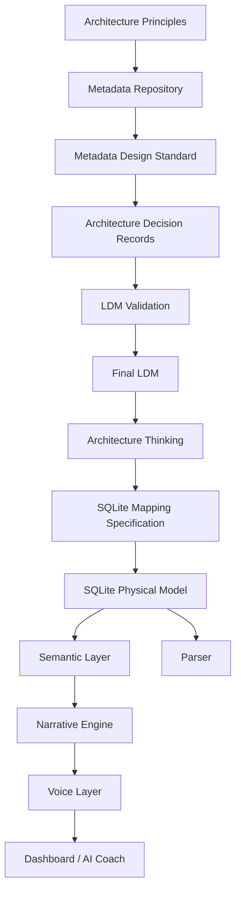

# Architecture Roadmap

## Purpose

This roadmap tracks architecture maturity for CoachOS.

Product-facing version naming is handled in [`CoachOS Product Roadmap v1.0 Draft.md`](/Users/perryliu/Documents/Running%20Analytics/docs/00_Governance/CoachOS%20Product%20Roadmap%20v1.0%20Draft.md).

## Product Architecture



The project is now governed by a Metadata-First architecture:



## Milestones

| Milestone | Scope | Status |
|---|---|---|
| v1.1 | Metadata Repository and governance baseline | Active |
| v1.2 | Canonical Data Model complete | Complete |
| v1.3 | SQLite schema stable | Real-data verified |
| v1.32 | Semantic Layer v1.0 | In progress |
| v1.35 | First end-to-end pipeline verified | Complete |
| v1.4 | Parser stable against Metadata Repository | In progress |
| Platform v1.0.0 | First platform release | Released |
| v2.0 | AI Coach | Pending |
| v3.0 | Digital Twin Runner | Future |

## Current Architecture State

| Artifact | Version | Status |
|---|---|---|
| Architecture Principles | v1.0 | Active |
| Metadata Repository | v1.1 | Active |
| Metadata Design Standard | v1.0 | Active |
| Activity LDM | v1.1 | Final / frozen |
| Kilometer Split LDM | v1.1 | Final / frozen |
| SQLite Mapping Specification | v1.0 | Core mapping complete |
| Shoe LDM | v1.1 | Final / frozen |
| Workout Type LDM | v1.1 | Final / frozen |
| Training Purpose LDM | v1.1 | Final / frozen |
| Activity Training Purpose LDM | v1.1 | Final / frozen |
| SQLite Schema | v1.0 | Core schema real-data verified |
| Semantic Layer | v1.0 | Initial semantic views active |
| Narrative Engine Boundary Draft | v0.1 | Active draft |
| SQLite Importer / Parser | Internal milestone E2E-002 | SQLite Schema v1.0 real-data verified |
| Excel Schema | v1.1 | Active |
| Dashboard App | v0.4.12-alpha | Weekly Polish reframed the week page as a coaching review meeting with verdict, focus, why, and next |
| CoachOS | v1.2.0 | Released |

## Current Semantic Layer Milestone

`Semantic Layer v1.0` is now active as the product-facing SQL layer between SQLite storage and dashboard/query experiences.

Scope:

- `activity_review_view`
- `platform_summary_view`
- `monthly_summary_view`
- `current_month_summary_view`
- `current_month_intelligence_view`
- `current_month_training_distribution_view`
- `weekly_summary_view`
- `current_week_summary_view`
- `current_week_intelligence_view`
- `training_distribution_view`
- `training_balance_view`
- `training_assignment_quality_view`
- `recent_training_intent_view`
- `shoe_comparison_view`
- `shoe_intelligence_view`
- `shoe_workout_comparison_view`
- `recent_activity_view`
- `journey_month_story_view`
- `journey_turning_point_view`

## Current Physical Layer Milestone

`SQLite Schema v1.0` has been verified with real project imports and parser/importer behavior is aligned with the six-table physical model.

Scope:

- `shoe`
- `workout_type`
- `training_purpose`
- `activity`
- `activity_training_purpose`
- `kilometer_split`
- core views

## Engineering Verification

### Semantic Layer v1.0 - Initial Views Active

```text
SQLite Schema v1.0
  ↓
Semantic Layer v1.0
  ↓
Query Layer / Dashboard
```

Verified with real project data:

- Semantic views can be created on top of the real-data-verified SQLite database.
- Query Layer commands now read semantic views for:
  - overall summary
  - rolling weekly summary
  - shoe comparison
  - workout / purpose distribution
- Dashboard now reads semantic views for:
  - platform summary
  - current week summary
  - weekly intelligence
  - activity review context
  - recent activities
- Activity review context now exposes semantic fields such as:
  - workout name
  - shoe display name
  - primary / secondary training purpose
  - weather / feel context

### Internal Milestone E2E-002 - SQLite Schema v1.0 Real-Data Verified

```text
FIT
  ↓
SQLite Importer / Parser
  ↓
SQLite Schema v1.0
  ↓
Core Views
```

Verified with real project data:

- `210 / 210` FIT files imported successfully into a clean SQLite v1.0 database.
- `210` activities created.
- `2453` kilometer splits created.
- `shoe`, `workout_type`, and `training_purpose` reference data seeded/upserted.
- `fit_sha256` idempotent upsert verified by repeating the full import.
- `activity_view`, `kilometer_split_view`, `activity_training_purpose_view`, and `shoe_statistics_view` query successfully.
- Derived pace fields are calculated by views, not stored in core fact tables.
- Foreign key check is clean.
- Real FIT plus supplied metadata can populate `shoe_id`, `workout_type_id`, and `activity_training_purpose` with `PRIMARY` / `SECONDARY` roles.

Note:

- Raw FIT files do not contain manual shoe, workout intent, or training purpose data. The importer therefore does not invent these values. It writes the bridge table only when metadata is supplied or training purpose can be derived from supplied workout type metadata.

### Internal Milestone E2E-001 - First End-to-End Pipeline Verified

```text
FIT
  ↓
Parser / Excel Exporter
  ↓
Excel v1.1
  ↓
SQLite v0.1
  ↓
Views
```

Verified with real project data:

- `126 / 126` FIT files imported successfully.
- `126` activities created.
- `1540` kilometer splits created.
- `fit_sha256` idempotent upsert verified.
- Foreign key check clean.
- `activity_view` and `kilometer_split_view` calculate derived pace fields successfully.

### Dashboard App v0.4.6-alpha

Scope:

- Refines Monthly Coaching Review from a month dashboard into a coach-first review surface.
- Applies `Product Design Principles v1.0` directly to the monthly page:
  - decision before data
  - verdict before evidence
  - human language before metrics
- Adds month assignment quality semantics so confidence can be explained rather than merely labeled.

### Dashboard App v0.4.7-alpha

Scope:

- Adds `Journey v0.1` as a new product surface on top of Semantic Layer v1.0.
- Treats each month as a governed training chapter rather than a plain calendar bucket.
- Uses semantic journey story and turning-point views to surface chapter labels, coaching continuity, milestone moments, and next-chapter direction.

### Dashboard App v0.4.8-alpha

Scope:

- Moves Journey from structural availability to narrative polish.
- Frames each month as a chapter with reflection, growth language, and chapter-level meaning.
- Starts shifting Journey away from report tables and toward story-like representative session cards.
- Keeps Monthly Review focused on state, reason, and recommendation before exploration.

### Dashboard App v0.4.9-alpha

Scope:

- Continues Journey as `Less, but Deeper` rather than adding new modules or metrics.
- Strengthens chapter aftertaste through emotion, future-self memory, and more meaningful turning-point language.
- Reframes representative sessions as story fragments so Journey leaves behind scenes, not only summaries.
- Keeps the product aligned to the maturity rule that every improvement should earn another visit.

Data flow:

```text
SQLite v1.0
  ↓
Semantic Layer v1.0
  ↓
Query Layer v0.1
  ↓
Dashboard App v0.4.6
```

### Dashboard App v0.4.5-alpha

Scope:

- Keeps Overview, Monthly Review, Weekly Review, Shoes, and Training as separate product surfaces
- Refines the month surface into a coach-oriented review with month status, month progress, key sessions, and next-month guidance
- Adds `current_month_progress_view` and `current_month_key_sessions_view` as governed semantic inputs for product-facing monthly coaching surfaces
- Continues to separate strategy-level monthly review from execution-level weekly review
- Separate application from the Converter App

Data flow:

```text
SQLite v1.0
  ↓
Semantic Layer v1.0
  ↓
Query Layer v0.1
  ↓
Dashboard App v0.4.5
```

### Dashboard App v0.4.4-alpha

Scope:

- Keeps Overview, Monthly Review, Weekly Review, Shoes, and Training as separate product surfaces
- Adds `Monthly Review` page for latest-month summary, month trend, and current-month workout/purpose distribution
- Reuses semantic monthly views instead of duplicating month aggregation logic inside Dashboard code
- Distinguishes complete months from month-to-date review using governed semantic flags
- Separate application from the Converter App

Data flow:

```text
SQLite v1.0
  ↓
Semantic Layer v1.0
  ↓
Query Layer v0.1
  ↓
Dashboard App v0.4.4
```

### Dashboard App v0.4.3-alpha

Scope:

- Keeps Overview, Weekly Review, Shoes, and Training as separate product surfaces
- Adds `Training` page for training distribution, balance, tagging quality, and recent training intent
- Adds `training_balance_view`, `training_assignment_quality_view`, and `recent_training_intent_view`
- Exposes metadata quality directly in the product through tagged vs unassigned ratios
- Creates a product surface that can later support Metadata Assistant workflows
- Separate application from the Converter App

Data flow:

```text
SQLite v1.0
  ↓
Semantic Layer v1.0
  ↓
Query Layer v0.1
  ↓
Dashboard App v0.4.3
```

## Architecture Definition of Done (Architecture DoD)

An LDM can be marked Final only after:

1. It is validated against the Metadata Repository.
2. It complies with the Metadata Design Standard.
3. Validation decisions are recorded.
4. Release notes are updated.
5. A Final LDM document is produced.

Checklist:

```text
[ ] Metadata Verified
[ ] Standard Compliant
[ ] Validation Completed
[ ] Release Notes Updated
[ ] Final LDM Published
```
